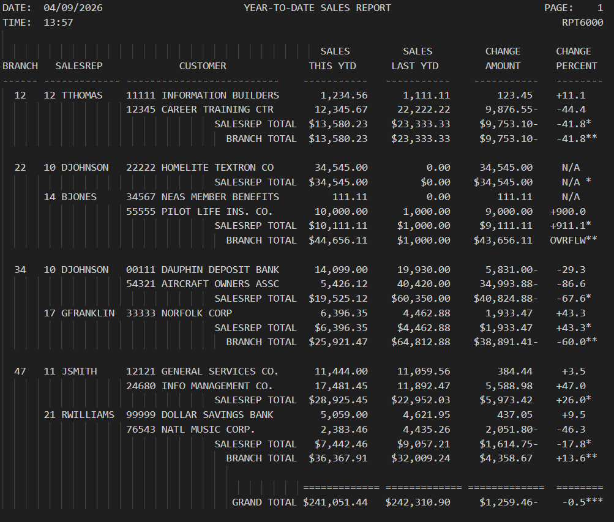
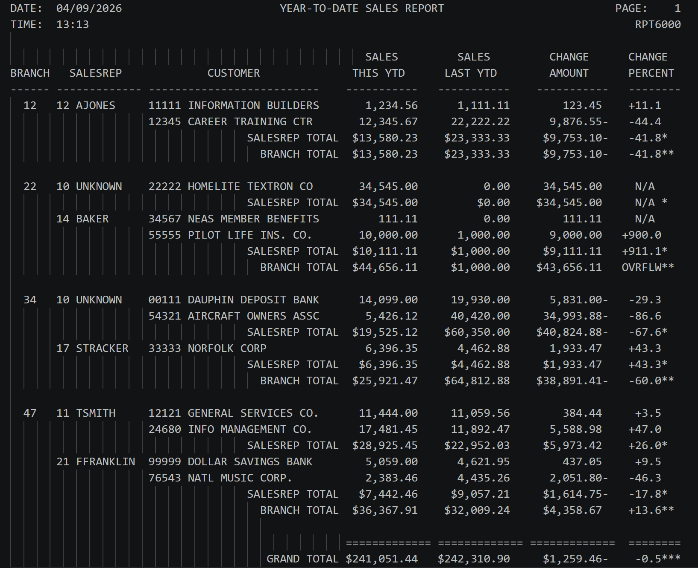

# RPT 6000
 

---

## 👤 Authors
Ben Stearns - [@bstearns07](https://github.com/bstearns07) 
Tristan Joubert - [@TJouber004](https://github.com/TJoubert004)
---

## 📑 Table of Contents
- [📌 Summary](#-summary)
- [✨ Features](#-features)
- [🧾Report Breakdown](#-report-breakdown)
- [⚙️ How It Works](#how-it-works)
- [🧰 Tech Stack](#-tech-stack)
- [🧠 Topics Covered](#-topics-covered)
- [📘 What I Learned](#-what-i-learned)
- [🖼 Screenshots](#-screenshots)

---

## 📌 Summary

The **Report 6000** application adds even more COBOL bells and whistles to make the code and report look more polished than ever before.
Not only does the code utilize more COBOL features to make the code more readable and flexible such as INITIALIZE, PACKED-DECIMAL, and REDIFINE statements, but now the report displays the salerep's name. How does it do that you make ask? Why, with a table lookup of course. A new data file has been added to the program, which is then read in by the program to find a rep's name by their id. 
 
For full program details, refer to [Program Requirements](./assets/Assignment_Instruction.pdf) 

---

## ✨ Features

- Sorted by branch number and sale representive number
- Customer sales totals by this year-to-date, last-year-to-date, change amount, and chance percent
- Final totals across all customer for this year-to-date, last-year-to-date, change amount, and chance percent
- Both branch AND sale representative sale totals
- More standadized COBOL coding syntax
- (new) Additional EVALUATE, PACKED-DECIMAL, and REDIFINE statements for more concise/flexible coding
- (new) Looks up a salerep's name by their id within a Table data structure
- (new) Copies data from other members
---

## 🧾 Report Breakdown

### 📊 Report Fields Overview
| Field | Description |
|------|-------------|
| 🏢 Branch | The ID number of the branch that handled the sale |
| 👤 Sales Rep | The representative ID and name responsible for the sale |
| 🆔 Customer | Unique ID and name of the customer |
| 💰 Sales This YTD | Total sales for the current year-to-date |
| 📉 Sales Last YTD | Total sales for the previous year-to-date |

---

### 📈 Calculated Metrics
| Metric | Description | Formula |
|-------|------------|---------|
| 💵 Change Amount | Difference between current and previous YTD sales | `Sales This YTD - Sales Last YTD` |
| 📊 Change Percent | Percentage change between current and previous YTD sales | `(Change Amount * 100) / Sales Last YTD` |

---

### ⚠️ Special Case Handling
| Condition | Behavior |
|----------|----------|
| 🚫 Sales Last YTD = 0 | Change Percent is set to `OVRFLW` |
---
## 🧰 Tech Stack

- Enterprise COBOL 6.4 (Semantic Markup)
- IBM z/OS mainframe for development and compiling
- ZOWE Explorer Studio Code extension

### 🧩 Core Concepts
- Report generation with standard alignments
- Reading data in from another mainframe member
- Proper setup of Environment and Data divisions for reading in data from other members
- Utilizing copy members to copy in data from another memeber for easy re-use

### 🛠 Development Tools
- Marist z/OS Mainframe environment
- Visual Studio Code with ZOWE Explorer extension

---
## How It Works

1. Upload the repository's associated .cbl, .jcl, CUSTMAST, SALESREP, and SYSLIB data members to your mainframe environment
2. Modify the JCL username on line 1 and the DSN names to match the filepaths for where the members are in your environment
3. Sumbit the JCL job for processing

---

## 🧠 Topics Covered

* **Table Processing & Lookups**: Implemented internal tables using the `OCCURS` clause and optimized data retrieval with the `SEARCH` verb and `INDEXED BY` to dynamically find sales representative names.
* **Data Internalization (COPY Members)**: Utilized `COPY` statements to pull in external record definitions for `CUSTMAST` and `SALESREP`, promoting modularity and code reusability.
* **Advanced Data Types**: Implemented `PACKED-DECIMAL` (COMP-3) for `PRINT-FIELDS` , `TOTAL-FIELDS` , and `CALCULATED-FIELDS` to optimize mainframe storage and computational performance.
* **Memory Redefinition**: Leveraged the `REDEFINES` clause to handle multiple data formats for the same memory area, allowing the program to display alphanumeric strings like "N/A" or "OVRFLW" in numeric report fields.
* **Control Break Logic**: Managed multi-level reporting by detecting changes in branch and sales rep numbers to trigger nested sub-total and total line printing.

---

## 📘 What I Learned

* **Efficiency with INITIALIZE**: I learned to use the `INITIALIZE` verb to clear entire group items and tables at once, which is much cleaner than individual `MOVE` statements.
* **Handling Division by Zero**: I gained experience in proactive error handling by checking for zero values in `SALES-LAST-YTD` before division  and using `ON SIZE ERROR` to manage numeric overflows.
* **Dynamic Loading**: I developed a routine to pre-load auxiliary data into an indexed table (`200-LOAD-SALESREP-TABLE`), reducing the overhead of repetitive file I/O during main report processing.
* **Standardized Coding Syntax**: Transitioned to more robust `EVALUATE TRUE` structures for main logic control and customer line formatting, which significantly improved the readability of the program compared to standard `IF` statements.
* **Professional Reporting**: I learned how to use `REDEFINES` to create a more user-friendly output, ensuring the report remains professional even when calculations cannot be performed or exceed field limits.

---

## 🖼 Screenshots

### 🖼 Final Report

### 🖼 Unknown Name Validation

⬆️ [Back to Top](#-smartwatch-faq)
